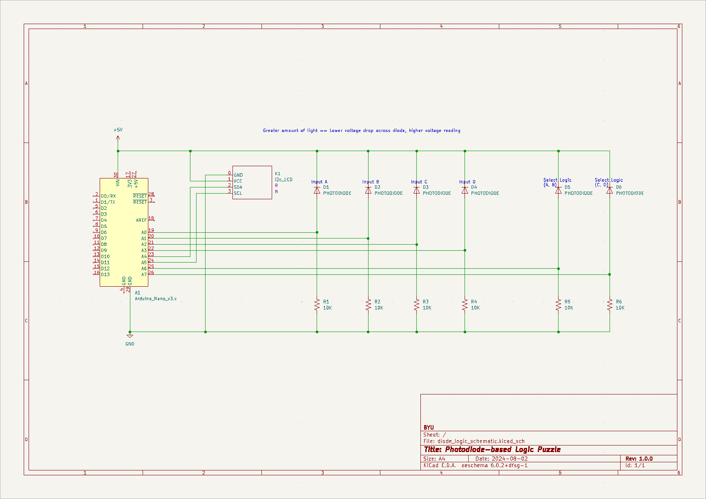

# Photodiode-based Logic Puzzle

## Background

This project is meant to be used as an interactive display as a part of a tour for BYU's University 101 class.
To make the display more resilient, the logic interactions are done with photodiodes rather than buttons or switches as a constraint.

## Parts

* Arduino Nano
* 6 flat headed photodiodes (see the [datasheet](SGPD5029A.PDF))
* 6 10k𝝮 resistors
* A i2c 16X2 character LCD

## Usage

The LCD will display three things:

* The current logic selected for the A and B inputs
* The current logic selected for the C and D inputs
* The clue keyword needed to progress in the puzzle

The clue results are pulled from an internal array.
The output of A/B is stored as an upper bit, C/D is a lower bit.

Other parts of the puzzle need to give what type of logic functions to use and what inputs to cover.
Note that an input being covered is considered a logical `1` (using negative logic).

## Improvements that could be made

* It may not be clear to a user when the threshold is met
* An actual casing needs to be built
